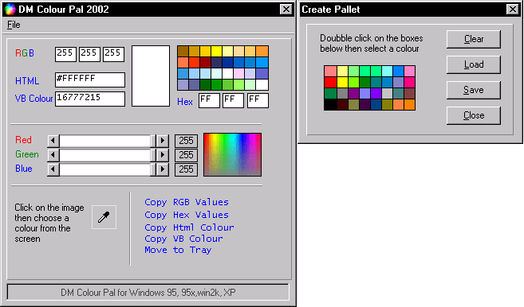



## DM Colour Pal \- Update

### Description

Hi this is an update to mine DM Colour Picker anyway I now added Control so it can be added to the system tray added more colour stuff like Hex colour Vbcolour codes I have also changed the interface a little fixed some bugs also now added in part were you can make you own pallets anyway I hope you find it usfull please vote if you like it.
 
### More Info
 

             |
---                |---
**Submitted On**   |2002-05-10 15:41:40
**By**             |[dreamvb](https://github.com/Planet-Source-Code/PSCIndex/blob/master/ByAuthor/dreamvb.md)
**Level**          |Intermediate
**User Rating**    |4.8 (29 globes from 6 users)
**Compatibility**  |VB 5\.0, VB 6\.0
**Category**       |[Complete Applications](https://github.com/Planet-Source-Code/PSCIndex/blob/master/ByCategory/complete-applications__1-27.md)
**World**          |[Visual Basic](https://github.com/Planet-Source-Code/PSCIndex/blob/master/ByWorld/visual-basic.md)
**Archive File**   |[DM\_Colour\_816135102002\.zip](https://github.com/Planet-Source-Code/dreamvb-dm-colour-pal-update__1-34558/archive/master.zip)

